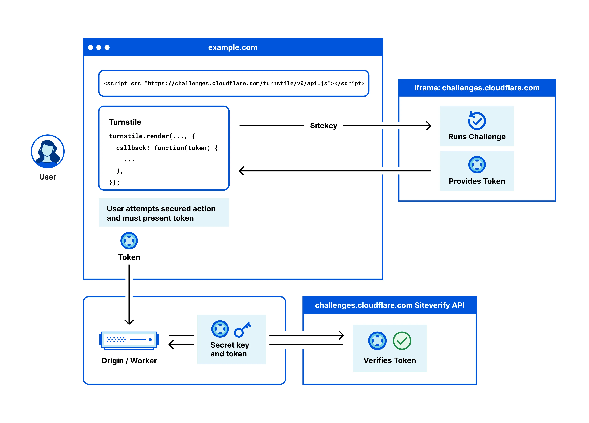

## Why rate limitting
 
1. Preventing Overload: Rate limiting controls how often a user or system can make requests to a service. This helps prevent overuse of resources, ensuring that the system remains available and responsive for all users. For example, rate limiting can stop a single user from making thousands of login attempts in a minute, which could otherwise degrade service for others.
2. Mitigating Abuse: Without rate limiting, an application could be more susceptible to abuse such as brute force attacks on passwords or spamming behavior. By limiting how often someone can perform an action, it reduces the feasibility of such attacks.
3. Managing Traffic: In high-traffic scenarios, like ticket sales for a popular event, rate limiting can help manage the load on a server, preventing crashes and ensuring a fairer distribution of service like bandwidth or access to the purchasing system.
4. DDoS( Distributed denial of service ) Protection: A DDoS attack involves overwhelming a site with a flood of traffic from multiple sources, which can make the website unavailable. DDoS protection mechanisms detect unusual traffic flows and can filter out malicious traffic, helping to keep the service operational despite the attack.

- import rateLimit from 'express-rate-limit';
const otpLimiter = rateLimit({
    windowMs: 5 * 60 * 1000, // 5 minutes
    max: 3, // Limit each IP to 3 OTP requests per windowMs
    message: 'Too many requests, please try again after 5 minutes',
    standardHeaders: true, // Return rate limit info in the `RateLimit-*` headers
    legacyHeaders: false, // Disable the `X-RateLimit-*` headers
});
- use otpLimiter as middleware 

- still DDOS Attacks are yhere .

## Captchas
Captchas are a great-sh solution to making sure the request was sent by a human and not by a machine
There are various freely available captchas, Cloudflare `Turnstile` is one of them

### Tuenstile 
- Cloudflare will give you:

1. Site key (used in frontend) : 
      <Turnstile onSuccess={(token) => {
        setToken(token)
      }} siteKey='0x4AAAAAABIAKmQiaS3Mlm4b' >
      CAPTCHA VERIFICATION IS ON ! 
      </Turnstile>

2. Secret key (used in backend to verify)

